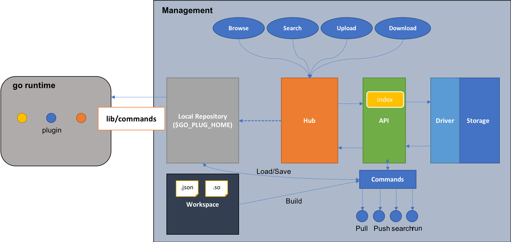

# ROADMAP

## Commands

```
goplug --help
  [sub commands]
  [options]
  --repo <URL> The remote plugin repository url
```

`goplug version` : print the SemVer version of the command
`goplug build <path>` : build go plugin specified by the path or plugins under the folder
`goplug search <pattern>`: search the specified plugins with the keyword
`goplug pull <name>`: pull the plugin with the name from the plugin repository to current workdir
`goplug push <plugin_path>`: push the plugin to the plugin repository
`goplug delete <name> --auth-token <secret>`: delete the plugin with the name from the repository if existing. A admin secret must be provided.
`goplug install <name>`: `pull` the plugin with the name to the plugin home dir ($GO_PLUG_HOME or '~/.goplug')
`goplug run <name> --values <values_map>`: execute the logic of the plugin

## Library

Provide a library to support loading plugins from the `$GO_PLUG_HOME` or other specified paths and running the logic of the plugins.

```go
import (
    "fmt"
    "github.com/steven-zou/go-plugin/lib"
)

func main(){
    //Set required plugins
    required := [] string {"required"}

    // Load plugins
    if err := goplug.Init(required); err != nil {
        panic(err)
    }

    res, err := goplug.run("required")
    if err != nil {
        panic(err)
    }

    results := <-res

    if results != nil {
        fmt.Printf("Get results: %v\n", results)
    }else{
        fmt.Println("Nothing get")
    }
}
```

## Components



## Authorizations

* Basic Auth
* OAuth